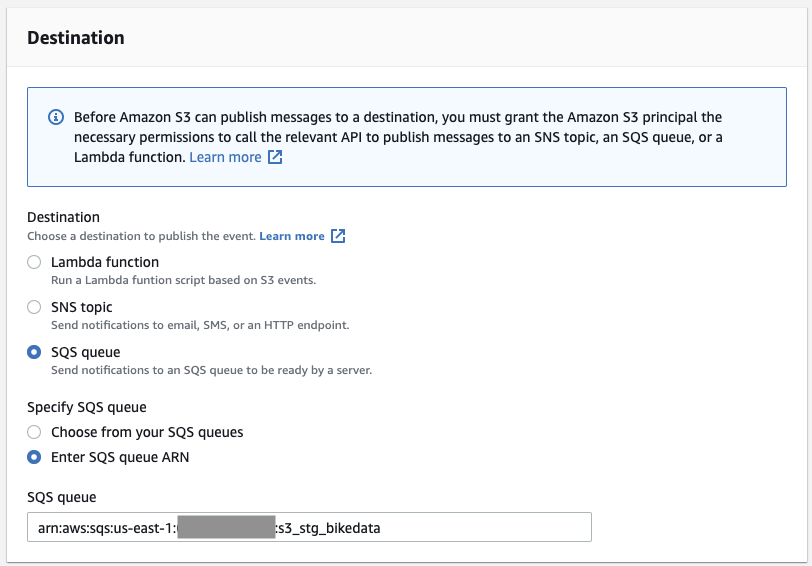

# Build a Fast and Efficient ELT Architecture with New Redshift Features

For many organizations moving from a batch frameworks to a faster moving streaming architecture can improve the ability to act on data.  Traditionally Data Warehouses were built for nightly batch, but this architecture can be hard to migrate to a continuous load.  Utilizing the AWS Analytical Ecosystem and feature enchancements in Redshift, we can build an efficient mini-batch load that is efficient, and optimized for data latency requirements.  For the purposes of this blog, I'm going to use a processed set of the NYC CitiBike Data for tracking the status of individual bikes.  These events are stored in a Type-2 SCD historical table that will allow analysts and data scientists the ability to easily get the status of a bike at any point in time.  This same pattern can extend to other use cases and datasets like subscription status, customer attributes like geography and channel, and product information.  Storing these as type-2 SCDs allow easier historical analysis instead of maintaining either current or snapshots of an operational system.

For the fast moving source of data, I'm going to use Kinesis which makes it easy to collect, process, and analyze real-time streaming data at any scale.  Once data is on the Kinesis Stream, I need to stage it in S3 at frequent intervals to make it available to load into Redshift.  Amazon Kinesis Data Firehose is the easiest way to reliably load streaming data into data lakes, data stores, and analytics services.  Once this data is landed in S3, I need to orchestrate loading the data to Redshift and performing a source to target transformation (ELT pattern) to integrate the events into the historical table.  Redshift loads most efficiently using COPY statements instead of individual inserts, but the many files that Firehose can generate ideally shouldn't be loaded invididually.  I'm using Amazon Simple Queue Service, a distributed message queuing service, to queue the files landing in S3 and generate a manifest for Redshift to load.  I can use Redshift's new Lambda UDF capability to generate the manifest file from the SQS queue from within Redshift

## Preparing the raw NYC Bike Data

To pre-process this data, I've seperated a bike's start and end stations and timestamps into individual records.  The EMR Notebook for this processing is here (link here).  I've also created a simple Kinesis Producer (producer.py) that streams data from the sample S3 dataset to a Kinesis Data Stream.

## Kinesis Data Stream and Firehose

### Kinesis Data Stream

For the simulated streaming events, we can use the console to easily create a new "bikedata" stream with a shard capacity of 10.


When the stream is ready, it will read as "Active" in the console.


### Firehose

To faciliate streaming this data to S3 where it will be staged for Redshift to ingest, we will create a Kinesis Firehose Delivery to S3.  This architecture does not use the deliver to Redshift option since the cluster is running in a private subnet in my VPC without a publically accessible IP address.

In the console click Services -> Amazon Kinesis -> Delivery Streams -> Create Delivery Stream.  Let's name the delivery stream "s3_stg_bikedata", choose "Kinesis Data Stream" as a source, and pick our existing "bikedata" stream we created in the previous step.  Click "Next" when finished.


Leave "Data Transformation" and "Record format conversion" disabled.  Click "Next".  For the destination, choose "Amazon S3" as the target.  I will be delivering the data to "s3://jwyant-bigdatablog/stg_bikedata" and error data to "s3://jwyant-bigdatablog/stg_bikedata_error".  Click "Next" when done.


Leave the next set of options as default except for "S3 compression".  We do want to compress objects since Redshift sees a performance benefit from loading compressed data.  It also saves on storage, and if this dataset is used for other analytics those downstream services can benefit from the compression as well.  You can use a IAM role created for this delivery or provide your own.  I'm opting to allow Firehose to create it's own IAM role for this delivery.  Click "Next".  On the next page, review the chosen options and click "Create delivery stream" if everything looks correct.

## Simple Queue Service and S3 Event Notifications

To keep track of what objects have been delivered to S3 we want to enable S3 event notifications and add them to a SQS queue.  In the AWS Console click Services -> Simple Queue Service -> Create queue.  Let's create a standard queue and name it "s3_stg_bikedata".  I'm leaving the visibility timeouts, delays, retention, and message size as default.  For the SQS access policy, I created the below policy.  Substitute your account ID and S3 buckets.

```
{
  "Version": "2012-10-17",
  "Id": "example-ID",
  "Statement": [
    {
      "Sid": "example-statement-ID",
      "Effect": "Allow",
      "Principal": {
        "AWS": "*"
      },
      "Action": "SQS:SendMessage",
      "Resource": "arn:aws:sqs:us-east-1:123456789012:s3_stg_bikedata",
      "Condition": {
        "StringEquals": {
          "aws:SourceAccount": "123456789012"
        },
        "ArnLike": {
          "aws:SourceArn": "arn:aws:s3:*:*:jwyant-bigdatablog"
        }
      }
    }
  ]
}
```

Click "Create queue" when done.

Next pull up the S3 console, click into the staging bucket we created for Firehose delivery, click properties, and then "Create event notification".  I'm naming my event notification "s3_event_stg_bikedata", the prefix is the same as the Firehose delivery prefix ("stg_bikedata/"). 


Checkbox "All object create events".


Choose "SQS queue" as the destination, and enter the SQS ARN we created in the previous step.



Now when Kinesis Firehose delivers a set of events to S3 in a gzipped JSON file, it will put that S3 key on the SQS queue.  This allows us to process off this queue and tune the frequency that we process data in mini-batch since the last run.

## Redshift

Now that we have a events streaming from our Kinesis Data Stream to gzipped JSON files, let's create a Redshift cluster to capture the data and transform the events to a historical view of each bike's status.

Click Services -> Amazon Redshift -> Create cluster.  For this demo I'm using a 3 node dc2.large cluster.  I'm also attaching an IAM role with S3 read access and an IAM role that Redshift can assume for Lambda execution.

## Lambda

Next we're going to create two Lambda functions: One to submit SQL against and another to generate a manifest from the SQS queue from within Redshift.

### Submit Redshift SQL Lambda

First we need to create a new layer with the latest boto3 library that includes the new Redshift Data API.  If the Python packaged with Lambda has been updated to the new boto3 library, you can skip this step.

On a UNIX-like EC2 instance or desktop computer running Python 3.7 or 3.8 let's create an package a Python environment with the latest boto3 package.

This is what I ran on my laptop to create this layer:
```
$ python3 -m venv python
$ source python/bin/activate
$ pip install boto3
pip freeze > requirements.txt
zip -r python3.zip python
```

After this is done, upload the .zip file to S3 so we can add the custom layer in Lambda.

In the Lambda Console (Services -> Lambda), under "Additional resources" click "Layers" -> click "Create layer".  Name your layer something descriptive (ex: python37-boto3), give it a description, choose the zipfile you uploaded to S3, and chose a compatible runtime (ex: Python 3.7 for my layer).

Now let's create the function itself!  Click "Create Function" to start.  Keep "Author from scratch" selected.  Name the function "redshift_submit" and select the runtime (Python 3.7 or 3.8) that matches the layer you built in the previous step.  You will need to attach an IAM policy with access to the Redshift Data API that Lambda can assume.  I'm using the AWS managed policy "AmazonRedshiftDataAccessFull".  Click "Create".

Select the "Layers" block in the "Designer" section, and then click "Add a layer", Click "Custom layers", and then select the layer you created in the previous step.  When that's done, click back on the "redshift_submit" block in the "Designer" section and enter this code:
```
import json
import boto3
from urllib.parse import urlparse

def lambda_handler(event, context):

    # Get rest of environment variables
    cluster_id = event['Redshift_ClusterIdentifier']
    database = event['Redshift_Database']
    secret_arn = event['Redshift_SecretArn']
    statement_name = event['Redshift_StatementName']
    sql = event['Redshift_Sql']

    redshift_data = boto3.client('redshift-data')

    response = redshift_data.execute_statement(
        ClusterIdentifier=cluster_id,
        Database=database,
        SecretArn=secret_arn,
        Sql=sql,
        StatementName=statement_name,
        WithEvent=True
    )

    return {
        'statusCode': 200,
        'body': {
            'Statement_Id': response['Id'],
        }
    }
```

You will notice that a parameter needed for this function to work is the Secret ARN for the Redshift cluser, so let's create that now.  Click Services -> Secrets Manager -> Store a new secret.  Choose "Credentials for Redshift cluster", enter the username and password you want this secret to use, choose the cluster we created earlier, and click "Next".  Give the secret a descriptive name like "redshift/bike/awsuser" and description.  Click "Next", review our options, and click "Store" when ready.  Make note of the ARN for the secret we just created.

### Redshift SQS Manifest Lambda

Now let's create the Lambda function to pull new S3 keys from the SQS queue, create a manifest JSON in S3, and return the S3 key for that manifest.  Create a new Lambda Function using the Python 3.8 environment, and let's name it "redshift_generate_manifest_sqs".  This function will need an IAM role with policies that allow it to access SQS and S3.  I'm using the managed policies "AmazonSQSFullAccess" and "AmazonS3FullAccess".  More restrictive policies can be used as well for a specific queue and S3 bucket/prefix.  

#### For the Lambda function's code use this:
```
import json
import boto3
from datetime import datetime

sqs = boto3.resource('sqs')

def lambda_handler(event, context):
    current_timestamp = datetime.utcnow().isoformat().replace(':','')
    t1 = event['arguments']
    queue = sqs.get_queue_by_name(QueueName=t1[0][0])

    s3_objects = []
    while True:
        messages = queue.receive_messages(MessageAttributeNames=['All'], MaxNumberOfMessages=10, VisibilityTimeout=60)
        if len(messages) == 0:
            break
        for message in messages:
            message_body = json.loads(message.body)
            try:
                records = message_body['Records']
            except KeyError as e:
                print('KeyError', e)
                pass
            for rec in records:
                s3_objects.append('s3://{0}/{1}'.format(rec['s3']['bucket']['name'], rec['s3']['object']['key']))
            message.delete()
    if len(s3_objects) > 0:
        entries_dict = dict(
                entries = [dict(url=x, mandatory=True) for x in s3_objects]
            )

        s3 = boto3.client('s3')
        s3.put_object(
            Body=json.dumps(entries_dict),
            Bucket='jwyant-bigdatablog',
            Key='stg_bikedata_manifests/{}.json'.format(current_timestamp)
        )
        ret = dict()
        ret['success'] = True
        ret['results'] = ['s3://jwyant-bigdatablog/stg_bikedata_manifests/{}.json'.format(current_timestamp)]
    else:
        ret = dict()
        ret['success'] = False
        ret['error_msg'] = "No Items in SQS Queue"
    ret_json = json.dumps(ret)
    return ret_json
```
Substitute your S3 buckets/prefixes in place of mine.  This code as triggered by a Redshift UDF will pull new S3 keys from the SQS queue, generate a manifest document, store it as JSON in S3 (3://jwyant-bigdatablog/stg_bikedata_manifests/timestamp_here.json), and return that S3 key for the manifest to Redshift as a result.  Go ahead and deploy this function.

### Redshift DDL, UDFs, and Stored Procedures Oh my!

Log into the Redshift cluster we created earlier.  Let's create tables for staging and target using this DDL:
```
CREATE TABLE public.stg_bikedata (
	bikeid INTEGER
	,activity_timestamp TIMESTAMP
	,activity_type CHAR(6) ENCODE ZSTD
	,station_id INTEGER ENCODE AZ64
	,station_latitude DECIMAL(10,8) ENCODE AZ64
	,station_longitude DECIMAL(10,8) ENCODE AZ64
	,station_name VARCHAR(64) ENCODE ZSTD
) DISTSTYLE KEY DISTKEY (bikeid) SORTKEY (bikeid, activity_timestamp);

CREATE TABLE public.bikedata (
	bikeid INTEGER
	,eff_timestamp TIMESTAMP ENCODE AZ64
	,end_timestamp TIMESTAMP
	,status VARCHAR(64) ENCODE ZSTD
	,station_id INTEGER ENCODE AZ64
	,station_latitude DECIMAL(10,8) ENCODE AZ64
	,station_longitude DECIMAL(10,8) ENCODE AZ64
	,station_name VARCHAR(64) ENCODE ZSTD
) DISTSTYLE KEY DISTKEY (bikeid) SORTKEY (bikeid, end_timestamp, eff_timestamp);
```

Next let's create the Redshift Lambda UDF to generate a manifest from the SQS queue's S3 events:
```
CREATE OR REPLACE EXTERNAL FUNCTION f_redshift_generate_manifest_sqs(varchar(128))
RETURNS VARCHAR(4096)
VOLATILE
LAMBDA 'redshift_generate_manifest_sqs'
IAM_ROLE 'arn:aws:iam::123456789012:role/Redshift_Lambda_Execution';
```

You can test this function with
```
select f_redshift_generate_manifest_sqs('s3_stg_bikedata');
```
where 's3_stg_bike_data is the name of our SQS queue.  This will return a S3 key with our manifest JSON.

Lastly on Redshift, we need to create the stored procedure to run the COPY from S3 and merge into the target table with our historical status for each bike.

```
CREATE OR REPLACE PROCEDURE public.sp_load_bikedata()
AS $$
DECLARE
	running_sp_load_bikedata_cnt int;
	manifest_uri text;
BEGIN
	-- Abort if already running
	SELECT INTO running_sp_load_bikedata_cnt count(*) FROM STV_INFLIGHT WHERE label = 'sp_load_bikedata';
	IF running_sp_load_bikedata_cnt > 0 THEN
	  RETURN;
	END IF;

	SET query_group TO 'sp_load_bikedata';

	manifest_uri := f_redshift_generate_manifest_sqs('s3_stg_bikedata');

	EXECUTE 'COPY public.stg_bikedata FROM ''' || manifest_uri || ''' iam_role ''arn:aws:iam::123456789012:role/myS3ReadRole'' manifest gzip format as json ''auto'' timeformat ''auto''';

	DROP TABLE IF EXISTS tmp_bikedata;
	CREATE TEMP TABLE tmp_bikedata AS
	SELECT
	stg.bikeid
	,stg.eff_timestamp
	,stg.end_timestamp
	,stg.status
	,stg.station_id
	,stg.station_longitude
	,stg.station_latitude
	,stg.station_name
	FROM (SELECT
		b.bikeid
		,b.eff_timestamp
		,a.activity_timestamp as end_timestamp
		,b.status
		,b.station_id
		,b.station_longitude
		,b.station_latitude
		,b.station_name
		,ROW_NUMBER() OVER (PARTITION BY a.bikeid ORDER BY a.activity_timestamp) AS rnum
		FROM public.stg_bikedata a
		LEFT JOIN public.bikedata b
		  ON a.bikeid = b.bikeid
		 AND b.eff_timestamp <= a.activity_timestamp
		 AND b.end_timestamp > a.activity_timestamp
	) stg
	WHERE stg.rnum = 1;

	DELETE FROM public.bikedata
	USING tmp_bikedata
	WHERE public.bikedata.bikeid = tmp_bikedata.bikeid
	  AND public.bikedata.eff_timestamp = tmp_bikedata.eff_timestamp;

	INSERT INTO public.bikedata
	SELECT
	bikeid
	,eff_timestamp
	,end_timestamp
	,status
	,station_id
	,station_longitude
	,station_latitude
	,station_name
	FROM (SELECT
		a.bikeid
		,a.activity_timestamp as eff_timestamp
		,COALESCE(b.activity_timestamp, '9999-12-31 23:59:59') as end_timestamp
		,a.activity_type as status
		,COALESCE(a.station_id, b.station_id) as station_id
		,COALESCE(a.station_latitude, b.station_latitude) as station_latitude
		,COALESCE(a.station_longitude, b.station_longitude) as station_longitude
		,COALESCE(a.station_name, b.station_name) as station_name
		,ROW_NUMBER() OVER (PARTITION BY a.bikeid, a.activity_timestamp ORDER BY b.activity_timestamp ASC) as rnum

		FROM public.stg_bikedata a

		LEFT JOIN public.stg_bikedata b
		   ON a.bikeid = b.bikeid
		  AND a.activity_timestamp < b.activity_timestamp

	) WHERE rnum = 1 OR rnum IS NULL
	UNION ALL
	SELECT * FROM tmp_bikedata;

	TRUNCATE public.stg_bikedata;

END
$$ LANGUAGE plpgsql;
```

This code will poll for a currently running stored procedure with the label "sp_load_bikedata" and abort if already running.  It will then generate a manifest JSON from the SQS queue and use that in a COPY from S3 statement to load the data.  We're next following Redshift [examples for a Merge statement](https://docs.aws.amazon.com/redshift/latest/dg/merge-examples.html) with some logic in there to handle the effective and end timestamps for the events.

## Eventbridge

The last task before we submit data against the Kinesis Stream is triggering the execution of the stored procedure by running the redshift_submit Lambda on a schedule.  This could also be event driven, but we're assuming a continuous stream of data that's updated at regular intervals for this architecture.  Go to Services -> Amazon EventBridge -> Rules -> "Create rule".  Name it "redshift_bikedata_cron" and give it a description like "run stg_bikedata to bikedata every X amount of time".  Choose a Schedule and a Fixed rate every 5 minutes (or whatever fits your data latency requirements).  Smaller intervals mean faster data, but too small of increments are inefficient for a mini-batch architecture.  Select "Lambda function" as the target, and pick the "redshift_submit" function we created earlier.  For the input, select Constant (JSON text) and model your input after the below:
```
{
  "Redshift_Sql": "CALL public.sp_load_bikedata()",
  "Redshift_ClusterIdentifier": "bike",
  "Redshift_Database": "dev",
  "Redshift_SecretArn": "arn:aws:secretsmanager:us-east-1:123456789012:secret:redshift/bike/awsuser-abcdef",
  "Redshift_StatementName": "stage to target bikedata"
}
```
Click "Create".

Now we're ready to start streaming.  I have an EC2 instance (t4g to be specific since I wanted to try out the new Gravitron 2 instances) with  a Python3 with boto3 libraries.  The producer.py file can be run with an argument for the number of threads it will create to submit data against the Kinesis stream.
```
$ python3 ./producer.py 32
```
The above example will submit 32 threads of data against the Kinesis stream.  If you dig into the code I'm basically adding a multiple of 100000 to each "bikeid" to expand the data for testing.  The Kinesis stream is partitioned by bikeid, and bikeid has high cardinality to begin with, so this scales very efficiently.

Results to follow.

